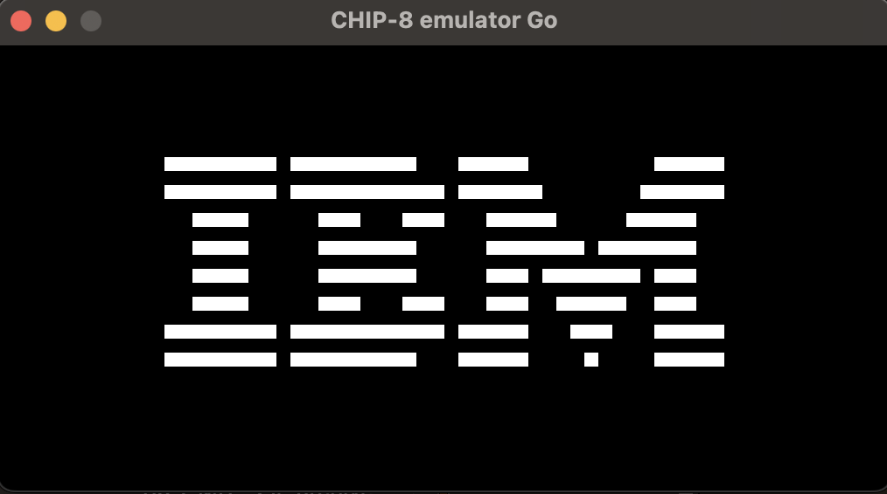

# CHIP-8 Emulator in Go

This is a simple CHIP-8 emulator written in Go using the Raylib library. The emulator reads CHIP-8 ROM files, interprets the instructions, and renders the output on a 64x32 pixel display (scaled by 8).

<div align="center">
  
</div>

## Features

- **Emulation of CHIP-8 instructions:** Supports basic CHIP-8 operations including memory management and drawing sprites.
- **Rendering with Raylib:** Uses Raylib for rendering the CHIP-8 display, scaled up for better visibility.
- **ROM Loading:** Load any CHIP-8 ROM file and run it in the emulator.

## Prerequisites

- **Go 1.18 or later**
- **Raylib-Go binding:** Install the Raylib-Go bindings by following the instructions [here](https://github.com/gen2brain/raylib-go).

## Installation

1. Clone this repository:

   ```sh
   git clone https://github.com/kaandesu/chip8-emulator-go.git
   cd chip8-emulator-go
   ```

2. Install the necessary Go dependencies::

   ```sh
   go get -u github.com/gen2brain/raylib-go/raylib
   ```

3. Compile and run the emulator::

   ```sh
   go run .
   ```

4. Usage

- Place the CHIP-8 ROM file in the `./demos/` directory.

- Modify the `LoadROM` function call in `setup()` to point to your ROM file:

  ```go
  err := Emulator.LoadROM("./demos/your-rom-file.ch8")
  ```

- Run the emulator to start the CHIP-8 program.
